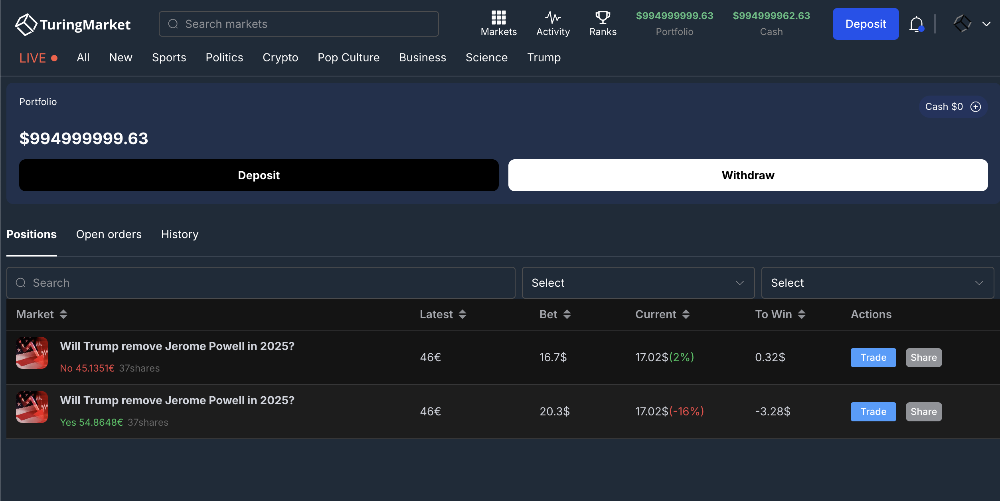

# Turing Market

## Introduction

Turing M is an AI collective data-driven event derivative financial ecosystem. Built on Web3 technology, it establishes a decentralized prediction market platform focusing on political/sports/entertainment multi-domain event prediction trading, breaking through traditional financial market limitations.

## Links

* testnet airdrop: https://avax-test-airdrop.turingmarket.cc/
* Dapp: https://avax-test.turingmarket.cc/
* Contract Deployment: 
  - AirdropApp: https://subnets-test.avax.network/c-chain/address/0xD873Ec2523A6d48466c0D5a3767E00b3B985545B
  - TokenUnlockerApp: https://subnets-test.avax.network/c-chain/address/0xeAfBF3f509BC6a0353Abb7336a02f88193104f5e
  - TuringMarketApp: https://subnets-test.avax.network/c-chain/address/0x93DeBeE714C2376Cd5648B8a89B89b92B01256B1
* Product Demo Video: https://youtu.be/ni6MiigAUMg
* Pitch Video: https://x.com/Turingmarket/status/1930945177381982507
* Pitch Deck: https://github.com/TuringM-Labs/jutopia2025/blob/main/TuringM-v3.4.pdf
* X: https://x.com/turingmarket
* Smart Contract code: https://github.com/TuringM-Labs/jutopia2025/


## Core Features


1. **AI Data Driven**: Implements Model Context Protocol (MCP) to integrate collective data for real-time market probability calibration
2. **Hybrid Trading Mechanism**: Supports multiple binary mutual-exclusive markets enabling complex strategies like hedging portfolios
3. **Liquidity Innovation**: Provides 7x24 instant market access with up to 10x leveraged trading
4. **Token Economy Loop**: TUIT token integration across trading/governance/staking scenarios forms demand growth flywheel


## Competitive Advantages


1. **Prediction Accuracy**: 42% improvement in event analysis efficiency compared to competitors
2. **User Incentives**: Includes token dividends (50% profit sharing) + prediction leaderboard + event proposal rewards
3. **Compliance Assurance**: Smart contract auto-settlement + compensation fund (50% operational cost) + anti-manipulation algorithms
4. **Community Co-creation**: Supports user-proposed event markets (proposers receive 1-3% transaction shares)


## Operational Benchmarks


1. **Competitor Reference**: Polymarket achieved 292% MAU growth (30K → 314.5K) in 2024 with annual trading volume exceeding $9B
2. **Revenue Structure**: Dual engine of transaction fees (2%) + outcome commissions (2%) targeting $120M first-year volume
3. **Distribution Model**: 70% for market expansion (agent/KOL commissions), 30% for token buyback & burn


## Differentiation Innovations



1. **Prediction+Derivatives**: Pioneers event option contracts supporting long/short positions
2. **Social Trading**: Built-in opinion sharing/copy-trading system with planned DAO governance integration
3. **Cross-Market Arbitrage**: Enables correlated trading strategies between real-world events and crypto market volatility


## Architecture


### Overview

The `TuringMarketFacet` contract implements atomic swaps between binary outcome tokens (ERC1155) and collateral assets (ERC20). 

It adopts a hybrid decentralized exchange model where operators provide off-chain matching services while settlement is completed trustlessly on-chain through signed order messages.

Turing Market supports matching orders containing mint/merge operations, allowing cross-matching of complementary outcome token orders. Orders use EIP712 standard structured data signature format.

Additionally, the contract implements a symmetric fee mechanism. When orders match, one party acts as maker and the other as taker, with price improvement benefits going to the taker side.

### Matching Scenarios

#### Asset Definitions

* **`A`** - ERC1155 outcome token
* **`A'`** - ERC1155 complementary outcome token*
* **`C`** - ERC20 collateral token
* All examples assume `A` and `A'` are priced at 0.5 USDC each

*Note: Complementary relationship means 1 outcome token + 1 complementary token can be merged into 1 collateral token, and vice versa (i.e., **`A`** + **`A'`** = **`C`**). Assume outcome tokens and collateral tokens have the same decimal precision. Examples assume **`C`** is USDC.

#### Scenario 1 - Minting Transaction

* user1 buys 100 `A`, transfers 50 `C` to exchange
* user2 buys 100 `A'`, transfers 50 `C` to exchange
* Exchange mints 100 `A` for user1, 100 `A'` for user2

```js
const takerOrder = {
    salt: randomId(),
    maker: user1,
    tokenId: 1, // Token ID for A'
    tokenAmount: 100 * 10**6,
    tokenPriceInPaymentToken: 0.5 * 10**6, // 0.5 USDC (could be 0 for market orders)
    paymentTokenAddress: '0xxxxx', // USDC address
    slippageBps: 100, // Allowed slippage (0 indicates limit order)
    deadline: 1672531200, // Expiration timestamp
    side: 1, // 1: buy, 2: sell
    feeTokenAddress: '', // Fee token address (USDC or company token)
    
    // Signature fields
    sig: 'xxxxx', // Frontend signature of above data
    
    // Off-chain calculated transaction details
    exchangeNftAmount: 100 * 10**6, // NFT amount maker will receive
    paymentTokenAmount: 100 * 10**6, // USDC amount maker must pay
    paymentTokenAddress: '0xxxxx', // Payment token address (USDC)
    
    // Dual fee fields for multi-token fee support
    fee1Amount: 123, // Primary fee amount
    fee1TokenAddress: '0xxxxx', // Primary fee token (USDC/company token)
    fee2Amount: 456, // Secondary fee amount
    fee2TokenAddress: '0xxxxx' // Secondary fee token (USDC/company token)
}

const makerOrders = [{
    salt: randomId(),
    maker: user2,
    tokenId: 2, // Token ID for A'
    tokenAmount: 100 * 10**6,
    tokenPriceInPaymentToken: 0.5 * 10**6,
    paymentTokenAddress: '0xxxxx',
    slippageBps: 100,
    deadline: 1672531200,
    side: 1,
    feeTokenAddress: '',
    sig: 'xxxxx',
    exchangeNftAmount: 100 * 10**6,
    paymentTokenAmount: 100 * 10**6,
    paymentTokenAddress: '0xxxxx',
    fee1Amount: 123,
    fee1TokenAddress: '0xxxxx',
    fee2Amount: 456,
    fee2TokenAddress: '0xxxxx'
}]

matchOrders(takerOrder, makerOrders)
```

#### Scenario 2 - Regular Transaction

* user1 buys 100 `A`, transfers 50 `C` to exchange
* user2 sells 100 `A`, receives 50 `C` from exchange

#### Scenario 3 - Merge Transaction

* user1 sells 100 `A`
* user2 sells 100 `A'`
* Exchange merges 100 `A` + 100 `A'` into 100 `C`
* Exchange transfers 50 `C` to user1
* Exchange transfers 50 `C` to user2

### Fee Mechanism

Fees are collected from output assets (proceeds). For complementary binary tokens (**`A`** + **`A'`** = **`C`**), fees must maintain symmetry to preserve market integrity. Symmetry means selling 100 `A` at $0.99 and buying 100 `A'` at $0.01 should incur equal fee value.

**Rules:**
- Buy operations (receiving **`A`**/**`A'`**) charge fees on output tokens
- Sell operations (receiving **`C`**) charge fees on collateral tokens

Base fee rate (`baseFeeRate`) is written into order structure, corresponding to 2x fee rate when tokens are equally priced ($0.50/$0.50). Price deviations use formula:

`USDC fee = baseFeeRate * min(price, 1-price) * token quantity`

*Example 1:*
- price = 0.2
- feeBps = 100
- fee = 0.01 * min(0.2, 0.8) * 100 = 0.2

*Example 2:*
- Selling 100 `A` at $0.99:  
  0.01 * min(0.99, 0.01) * 100 = 0.01 (deduct 0.01 `C` as fee)
- Buying 100 `A'` at $0.01:  
  0.01 * min(0.01, 0.99) * 100 = 0.01 (deduct 1 `A'` as fee)


## Team Information

- **Jesse** CEO 10+ years SaaS software market expansion experience
- **RichRed** Investment Director Years of Crypto market investment experience
- **Sam** Chief Talent Officer
- **David** CTO Years of CEX architecture experience, delivered multiple CEX projects
- **George** CPO 10+ years internet financial product leadership experience
- **Adam** Chief Development Engineer 5+ years blockchain development, 10+ years full-stack experience
- **Rushen** Project Director & Agile Coach Years of project management experience
- **Reyo** CMO Chief Community Operations Manager
